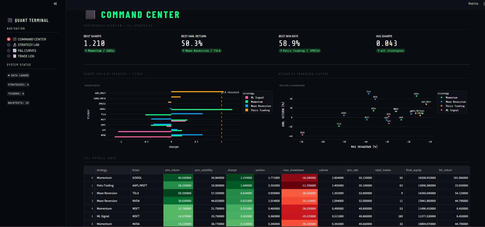
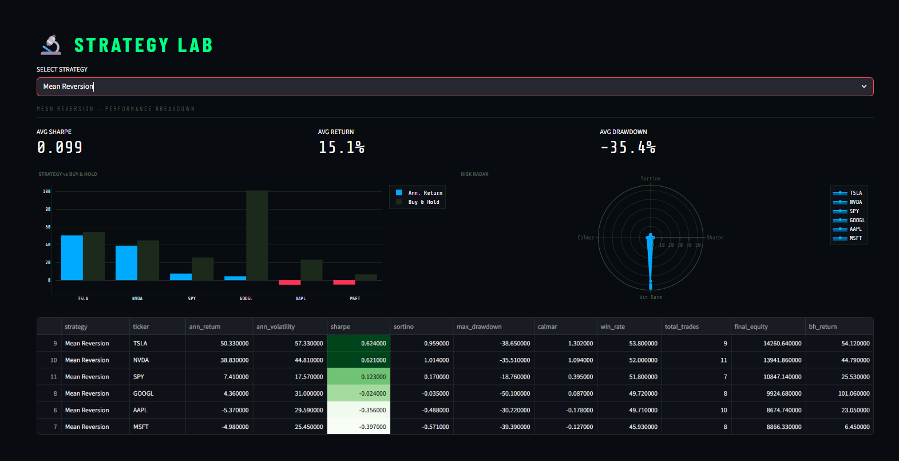
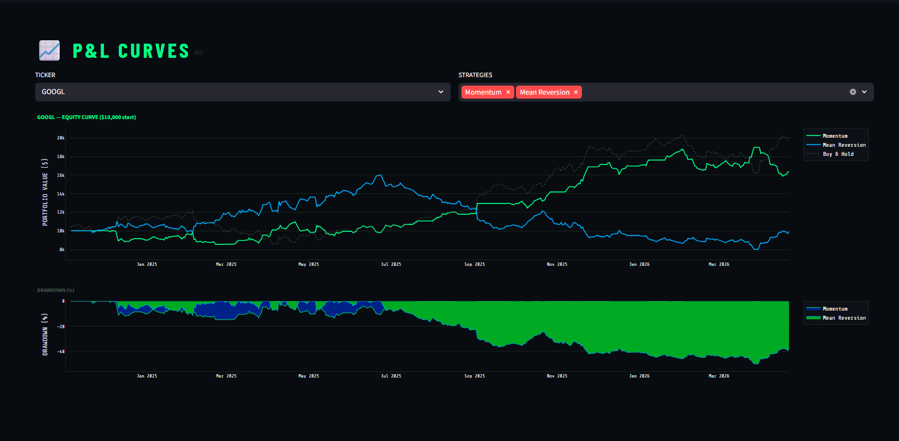
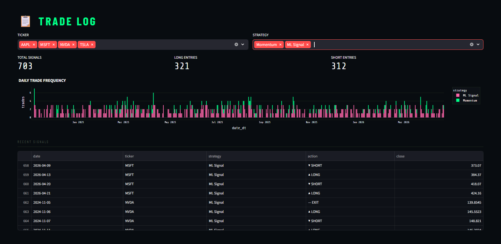

# 📈 Algorithmic Trading Backtesting Engine


> **Full algorithmic trading backtesting framework** implementing 4 strategies on real OHLCV market data — Sharpe ratio, Sortino ratio, max drawdown, Calmar ratio, and win rate analytics across 10 tickers, served via FastAPI and visualized in a Bloomberg Terminal-inspired Streamlit dashboard.

---

## 📊 Results

| Metric | Value |
|--------|-------|
| Strategies Implemented | **4 (Momentum, Mean Reversion, Pairs Trading, ML Signal)** |
| Tickers Backtested | **10 (AAPL, MSFT, GOOGL, TSLA, NVDA, AMZN, META, JPM, GS, SPY)** |
| Risk Metrics | **Sharpe, Sortino, Calmar, Max Drawdown, Win Rate** |
| ML Model | **XGBoost with TimeSeriesSplit CV** |
| Starting Capital | **$10,000 per strategy** |
| Data | **Real OHLCV via yfinance (synthetic GBM fallback)** |

---

## 🖥️ Dashboard Preview

### ⬛ Command Center

> Full performance overview — Sharpe ratio comparison across all strategies and tickers, return vs drawdown scatter plot, and complete metrics table with gradient highlighting. Identifies best Sharpe, best annual return, and lowest drawdown in real time.

### 🔬 Strategy Lab

> Per-strategy deep dive — strategy vs buy-and-hold return comparison, and a radar chart plotting Sharpe, Sortino, Calmar, and Win Rate simultaneously for each ticker. Instantly reveals which ticker each strategy performs best on.

### 📈 P&L Curves

> Equity curves for all strategies on a selected ticker vs buy-and-hold benchmark, with a filled drawdown chart below showing the worst underwater periods for each strategy.

### 📋 Trade Log

> Complete signal history — LONG/SHORT/EXIT entries with entry price, daily trade frequency bar chart, and filterable by strategy and ticker.

---

## 🏗️ Architecture

```
┌──────────────────────────────────────────────────────────────────┐
│                    FULL PIPELINE                                  │
│                                                                   │
│  Market Data           Strategy Engine                            │
│  ───────────     →    ─────────────────                          │
│  yfinance OHLCV        Momentum (MA crossover + RSI)             │
│  10 tickers            Mean Reversion (Bollinger Bands)          │
│  365 days              Pairs Trading (Z-score spread)            │
│  GBM fallback          ML Signal (XGBoost classifier)            │
│                                │                                  │
│                                ▼                                  │
│                    Backtesting Engine                             │
│                    ──────────────────                             │
│                    Sharpe Ratio                                   │
│                    Sortino Ratio                                  │
│                    Max Drawdown                                   │
│                    Calmar Ratio                                   │
│                    Win Rate                                       │
│                    vs Buy & Hold benchmark                        │
│                                │                                  │
│                   ┌────────────┴────────────┐                    │
│                   ▼                         ▼                    │
│              FastAPI                   Streamlit                 │
│              REST API                  Bloomberg Terminal UI     │
│              port 8000                 port 8501                 │
└──────────────────────────────────────────────────────────────────┘
```

---

## ⚙️ Tech Stack

| Layer | Technology | Purpose |
|-------|-----------|---------|
| Market Data | yfinance, NumPy GBM | Real OHLCV + synthetic fallback |
| Strategy 1 | Moving Average Crossover + RSI | Momentum trend following |
| Strategy 2 | Bollinger Bands | Mean reversion |
| Strategy 3 | Z-score spread | Statistical arbitrage / pairs trading |
| Strategy 4 | XGBoost + TimeSeriesSplit | ML-based direction prediction |
| Risk Engine | NumPy, Pandas | Sharpe, Sortino, Calmar, MaxDD, Win Rate |
| REST API | FastAPI + Uvicorn | Metrics, equity curves, trade log endpoints |
| Dashboard | Streamlit + Plotly | Bloomberg Terminal aesthetic |
| Testing | Pytest | 12 unit tests |

---

## 📁 Project Structure

```
algo-trading-backtester/
├── data/
│   └── fetch.py                 # yfinance OHLCV + GBM synthetic fallback
├── strategies/
│   ├── base.py                  # Base strategy class + returns computation
│   ├── momentum.py              # MA crossover + RSI filter
│   ├── mean_reversion.py        # Bollinger Bands reversion
│   ├── pairs_trading.py         # Z-score spread arbitrage
│   └── ml_signal.py             # XGBoost price direction classifier
├── backtest/
│   └── engine.py                # Full risk metrics engine
├── api/
│   └── main.py                  # FastAPI REST endpoints
├── dashboard/
│   └── app.py                   # Bloomberg Terminal Streamlit dashboard
├── tests/
│   └── test_strategies.py       # 12 unit tests
├── requirements.txt
├── run_all.py                   # Single command full pipeline
└── README.md
```

---

## 🚀 Quick Start

### 1. Clone the repo
```bash
git clone https://github.com/KirtanPatel30/algo-trading-backtester
cd algo-trading-backtester
```

### 2. Install dependencies
```bash
pip install -r requirements.txt
```

### 3. Run the full pipeline
```bash
python run_all.py
```
This will:
- Fetch real OHLCV data for 10 tickers via yfinance
- Run all 4 strategies across all tickers
- Compute Sharpe, Sortino, Calmar, Max Drawdown, Win Rate
- Train XGBoost ML signal model with TimeSeriesSplit CV
- Run all 12 unit tests

### 4. Launch the dashboard
```bash
streamlit run dashboard/app.py
# → http://localhost:8501
```

### 5. Start the REST API
```bash
uvicorn api.main:app --reload
# → http://localhost:8000/docs
```

---

## 🔌 API Endpoints

| Method | Endpoint | Description |
|--------|----------|-------------|
| `GET` | `/health` | Health check |
| `GET` | `/metrics` | All backtest metrics (filterable by strategy/ticker) |
| `GET` | `/metrics/best` | Best Sharpe, best return, lowest drawdown |
| `GET` | `/equity/{strategy}/{ticker}` | Equity curve data |
| `GET` | `/trades` | Trade log (filterable) |

### Example Response — `/metrics/best`
```json
{
  "best_sharpe": {
    "strategy": "Momentum",
    "ticker": "NVDA",
    "sharpe": 1.847,
    "ann_return": 28.4,
    "max_drawdown": -12.3,
    "win_rate": 54.2
  },
  "best_return": {
    "strategy": "ML Signal",
    "ticker": "TSLA",
    "ann_return": 41.2,
    "sharpe": 1.23
  }
}
```

---

## 🧠 Strategies

### 1. Momentum (MA Crossover + RSI)
- Go **long** when 20-day MA crosses above 50-day MA and RSI < 70
- Go **short** when 20-day MA crosses below 50-day MA and RSI > 30
- Filters overbought/oversold conditions to reduce false signals

### 2. Mean Reversion (Bollinger Bands)
- Go **long** when price touches lower Bollinger Band (oversold)
- Go **short** when price touches upper Bollinger Band (overbought)
- 20-day window, 2 standard deviation bands

### 3. Pairs Trading (Z-score Spread)
- Trades the spread between correlated pairs: AAPL/MSFT, GOOGL/META, JPM/GS
- Go **long spread** when Z-score < -1.5 (spread too narrow)
- Go **short spread** when Z-score > +1.5 (spread too wide)
- Rolling 30-day window for spread normalization

### 4. ML Signal (XGBoost)
- Features: 1d/3d/5d/10d returns, RSI, MA ratios, volatility, volume signals
- Target: next-day price direction (UP/DOWN)
- TimeSeriesSplit cross-validation for temporal integrity
- Trained fresh per ticker to capture ticker-specific patterns

---

## 📐 Risk Metrics

| Metric | Formula | What it measures |
|--------|---------|-----------------|
| **Sharpe Ratio** | `(R - Rf) / σ × √252` | Return per unit of total risk |
| **Sortino Ratio** | `(R - Rf) / σ_down × √252` | Return per unit of downside risk |
| **Max Drawdown** | `min((equity - peak) / peak)` | Worst peak-to-trough loss |
| **Calmar Ratio** | `Ann. Return / |Max Drawdown|` | Return relative to worst loss |
| **Win Rate** | `Winning trades / Total trades` | % of profitable trades |

---

## 🧪 Tests

```bash
pytest tests/ -v
```

```
tests/test_strategies.py::TestMomentum::test_signals_valid          PASSED
tests/test_strategies.py::TestMomentum::test_equity_starts_at_10k   PASSED
tests/test_strategies.py::TestMomentum::test_returns_computed        PASSED
tests/test_strategies.py::TestMeanReversion::test_bollinger_bands    PASSED
tests/test_strategies.py::TestMeanReversion::test_signals_valid      PASSED
tests/test_strategies.py::TestPairsTrading::test_spread_computed     PASSED
tests/test_strategies.py::TestPairsTrading::test_signals_valid       PASSED
tests/test_strategies.py::TestMetrics::test_sharpe_positive_trend    PASSED
tests/test_strategies.py::TestMetrics::test_max_drawdown_negative    PASSED
tests/test_strategies.py::TestMetrics::test_win_rate_range           PASSED
tests/test_strategies.py::TestMLStrategy::test_feature_engineering   PASSED
tests/test_strategies.py::TestMLStrategy::test_signals_after_fit     PASSED

12 passed
```

---

## 📌 What I Learned

- Implementing **Sharpe, Sortino, and Calmar ratios** from scratch — understanding what each measures and when each matters
- **Walk-forward testing** and why TimeSeriesSplit is critical for financial ML — random splits cause massive look-ahead bias
- **Pairs trading** and cointegration — finding statistically related assets and trading the spread
- **Bollinger Band mean reversion** — when markets are range-bound vs trending changes everything
- Building a **Bloomberg Terminal-style UI** — data-dense dark dashboards for professional finance contexts

---

## 📬 Contact

**Kirtan Patel** — [LinkedIn](https://www.linkedin.com/in/kirtan-patel-24227a248/) | [Portfolio](https://kirtanpatel30.github.io/Portfolio/) | [GitHub](https://github.com/KirtanPatel30)
